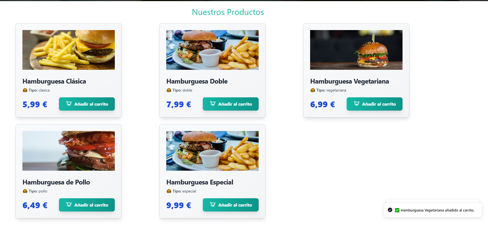
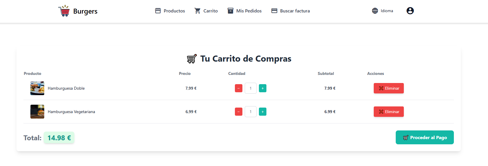
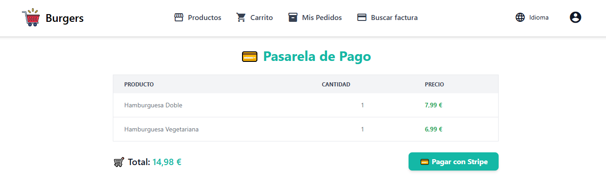
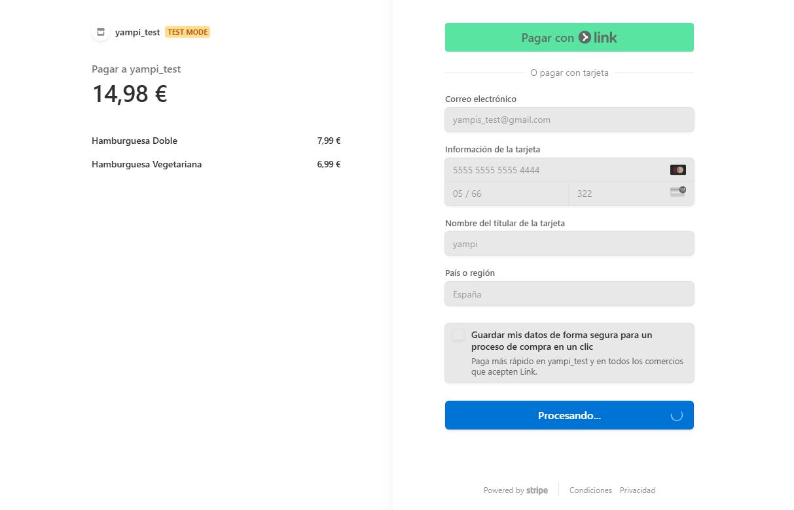
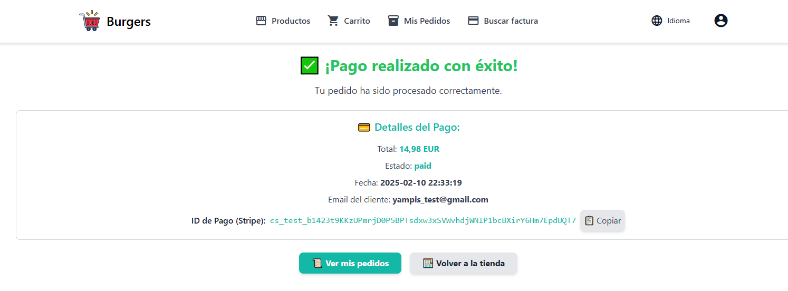
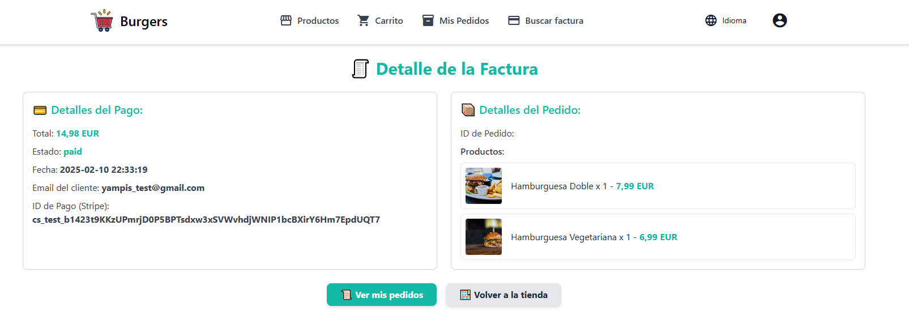
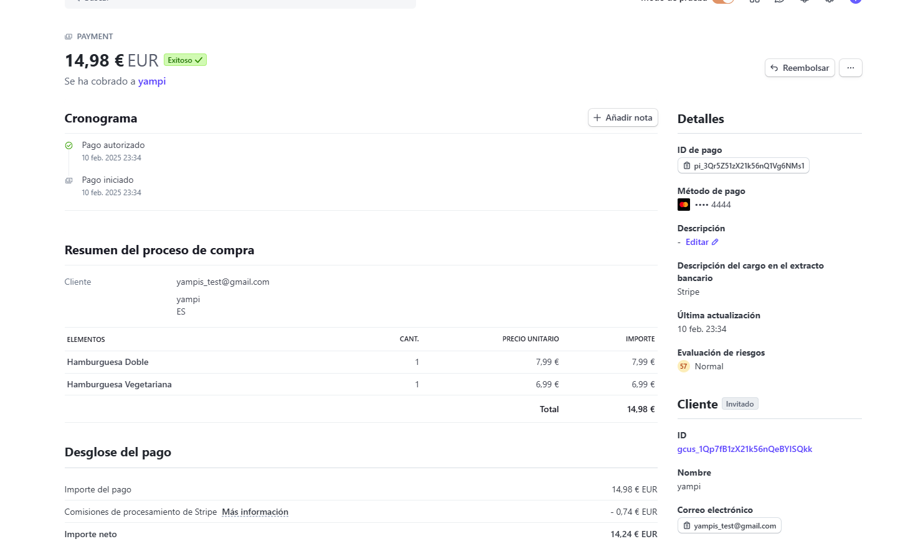

# Tienda - Proyecto Django

Este es un proyecto basado en Django 5.0 que implementa una tienda en línea con funcionalidades como:

- Autenticación de usuarios con django-allauth y login social.
- Carrito de compras con django-money para múltiples monedas.
- Pagos con Stripe (¡sí, ahora puedes cobrar!).
- Soporte multi-idioma con django-parler.
- Pipeline de despliegue a AWS (posiblemente eliminada antes de que me cobren 💸).
- Frontend experimental con Vue.js a través de django-vite.

## 💡 **Disclaimer**: Este proyecto ya estaba avanzado antes de integrar Stripe, pero se realizaron adaptaciones para que los pagos funcionaran sin romper todo (o casi).

## Índice

1. 🛠 Requisitos previos
2. 🚀 Instalación
3. 🛒 Integración con Stripe
4. 📂 Aplicaciones Instaladas
5. 🔐 Autenticación y Permisos
6. 🌍 Configuración de Idiomas
7. 📦 Archivos Estáticos y Multimedia
8. 💼 Panel de Administración
9. 🚢 Despliegue en Producción
10. 📸 Capturas de Pantalla
11. 📝 Historias de Guerra

---

## 🛠 Requisitos previos

Antes de empezar, asegúrate de tener:

- Python 3.12+ 🐍
- PostgreSQL 🐘
- Virtualenv (opcional, pero recomendado)
- Node.js (opcional, si quieres probar la UI con Vue.js)

---

## 🚀 Instalación

1. Clona el repositorio:

```bash
git clone https://github.com/tu_usuario/tienda.git
cd tienda
```

2. Crear y activar un entorno virtual:

```bash
python -m venv venv
source venv/bin/activate  # En Windows: venv\Scripts\activate
```

3. Instala las dependencias **Importante: instalar getText**:

```bash
pip install -r requirements.txt
```

4. Crea un archivo `.env` en la raíz del proyecto con las siguientes variables:

```bash
SECRET_KEY=tu_secreto
DATABASE_NAME=tienda
DATABASE_USER=tienda
DATABASE_PASSWORD=thos
DATABASE_HOST=localhost
DATABASE_PORT=5432
STRIPE_PUBLIC_KEY=tu_clave_publica
STRIPE_SECRET_KEY=tu_clave_secreta
FACEBOOK_APP_ID=tu_facebook_id
FACEBOOK_APP_SECRET=tu_facebook_secret
```

5. Crea la base de datos y ejecuta las migraciones:

```bash
python manage.py migrate
```

6. Carga los datos iniciales:

```bash
python manage.py create_initial_data
```

7. Crea un superusuario:

```bash
python manage.py runserver
```

---

## 🛒 Integración con Stripe

Este proyecto usa Stripe en la app `payments` para procesar pagos de manera segura.

- Gestiona y procesa los pagos de los carritos de compra de los usuarios y de los usuarios sin cuenta.
- Webhooks de Stripe actualizan el estado de pago en la base de datos.
- Se almacenan facturas y enlaces de recibo en cada orden.

### Tarjetas de Prueba

| Tarjeta             | Estado                  |
| ------------------- | ----------------------- |
| 4242 4242 4242 4242 | Pago exitoso            |
| 4000 0000 0000 9995 | Pago rechazado          |
| 4000 0025 0000 3155 | Autenticación requerida |

### Demostración del funcionamiento de Stripe en la tienda

1. Añade productos al carrito.
   

   1.1 **Nota**: Si no tienens cuenta, lo guardarás en la sesión.

   1.2 **Importante**: No te dejará pagar si no tienes productos en el carrito.

2. Vez a la página de pago.
   
   2.1 **Nota**: Podemos modificar la cantidad de productos en el carrito de forma reactiva gracias a Vue.js.
3. Procede al pago.
   
   3.1 **Nota**: Dejamos que el Stripe gestione la autenticación y el pago. No almacenamos datos de tarjetas, ni datos del cliente. Solo los datos que Stripe nos devuelve.
4. Completa el pago con una tarjeta de prueba.
   
   4.1 **Nota**: Stripe nos devuelve un `payment_intent` que almacenamos en la base de datos para futuras referencias.
5. Copia el identificador de la orden y ve a la página de detalles.
   
   5.1 **Nota**: Podemos ver los detalles de la orden. Si el pago falla, se mostrará un mensaje de error.
6. Revisa los detalles de la orden en el buscador de facturas `buscar factura`.
   
   6.1 **Nota**: Podemos ver los detalles de la orden, la factura.
7. Al no tener un cuenta configurada, Stripe no nos devolverá de forma automática la factura. Pero podemos recuperarla desde el dashboard de Stripe.
   
   7.1 **Nota**: Podemos ver las facturas, los pagos y los detalles de la orden en el dashboard de Stripe.

## Aplicaciones Instaladas
